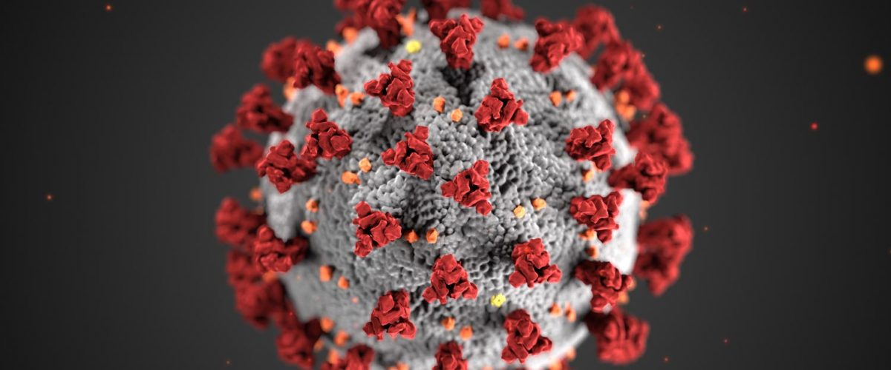

# A propos

## Pourquoi c19.sante.mr?

Le présent site internet a été conçu en s'appuyant sur les recommandations de l'organisation mondiale de la santé et à partir des ressources citées dans la rubrique [Liens utiles](ressources/ressources.md).  
Il vise à :

* faciliter la compréhension par la population des approches à suivre en cas de symptômes et d'interrogations sur le Coronavirus en Mauritanie.
* suivre la progression de la maladie en Mauritanie en s'appuyant sur les données locales
* prédire l'évolution de la maladie à partir:
  * des données locales communiquées par les autorités ou les partenaires
  * des données issues de pays voisins ou ayant des modes de vie similaires
* créer une communauté d'experts médecins, ingénieurs, citoyens afin de mutualiser les efforts pour mettre au point une stratégie pour contrer le virus

## **Qui sommes-nous?**

Ce site est le fruit d'une collaboration étroite entre ingénieurs, médecins et citoyens mauritaniens du monde avec l'appui des autorités mauritaniennes et la société Mauritel principal opérateur téléphonique en Mauritanie.

