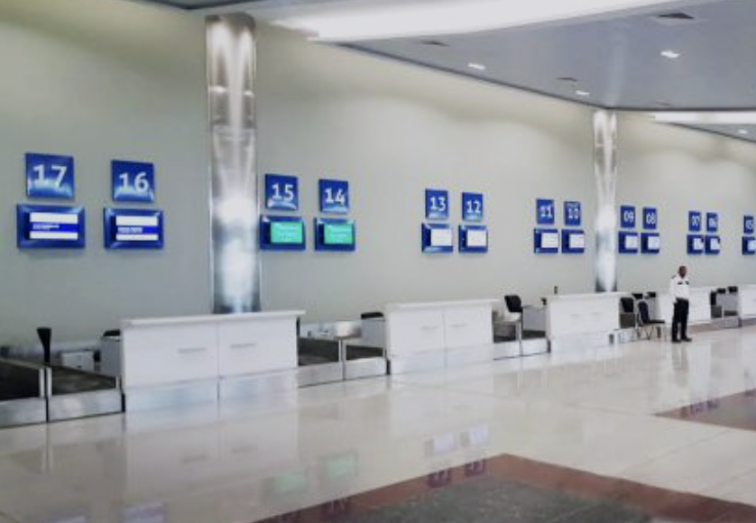

# Conseils aux voyageurs

Compte tenu de l’évolution de l’épidémie de Coronavirus Covid-19, il est préférable de reporter tous les déplacements à l’étranger, dans la mesure du possible.

## Je viens d'un pays très touché par la pandémie?

Je dois systématiquement me mettre en quarantaine pour au moins 14 jours et suivre les consignes relatives au suivi de l'évolution des symptômes, et comment réagir en cas d'apparition. \[section Consignes sanitaires\] 

## Je viens d'un pays peu touché par l'épidémie?

Il est quand même recommandé de s'isolé les premiers jours suivant son arrivée, et limiter les contacts et les déplacements qui ne sont pas nécessaires.

## Quelles sont les zones à risque ?

Un pays, ou une région, est considéré comme une zone à risque quand il a franchi le seuil épidémique, c’est à dire que le coronavirus COVID-19 circule activement.  
Actuellement les pays concernés sont :

* Chine : Chine continentale, Hong Kong, Macao 
* Singapour
* Corée du Sud
* Iran 
* Italie : régions d’Emilie-Romagne, de Lombardie et de Vénétie et du Piémont
* La France
* L'Angleterre 
* Les Etats-Unis

## Pour les personnes se trouvant déjà à l’étranger, il est recommandé :

 de s’informer régulièrement de la situation en consultant la rubrique Dernière minute des Conseils aux voyageurs du pays concerné, et de consulter régulièrement les pages de : l’[OMS](https://www.who.int/health-topics/coronavirus) , [le Ministère de la Santé ](http://www.sante.gov.mr/?lang=fr)et [le Ministère de l'intérieur](http://www.interieur.gov.mr/index.php?lang=fr) pour des renseignements concernant l'évolution des vols en provenance et vers la Mauritanie ainsi que les pays qui vous concerne.

## Dispositif de contrôle aux frontières 

 [Le Ministère de la Santé ](http://www.sante.gov.mr/?lang=fr) a souligné que des contrôles ont été mis en place au niveau des frontières dans les aéroports, les ports et les points de passage terrestres en vue de vérifier qu’aucune personne ne porte le virus.

## Comment sont pris en charge les éventuels patients symptomatiques à l’aéroport ?

Les personnes en provenance des pays touchés par l'épidémie sont mises en quarantaine pendant deux semaines dans des centres loin des populations, deux semaines sont la période requise pour s’assurer que les suspects ne portent pas le coronavirus, a expliqué le ministre de la santé dans un point de presse mardi à Nouakchott.

